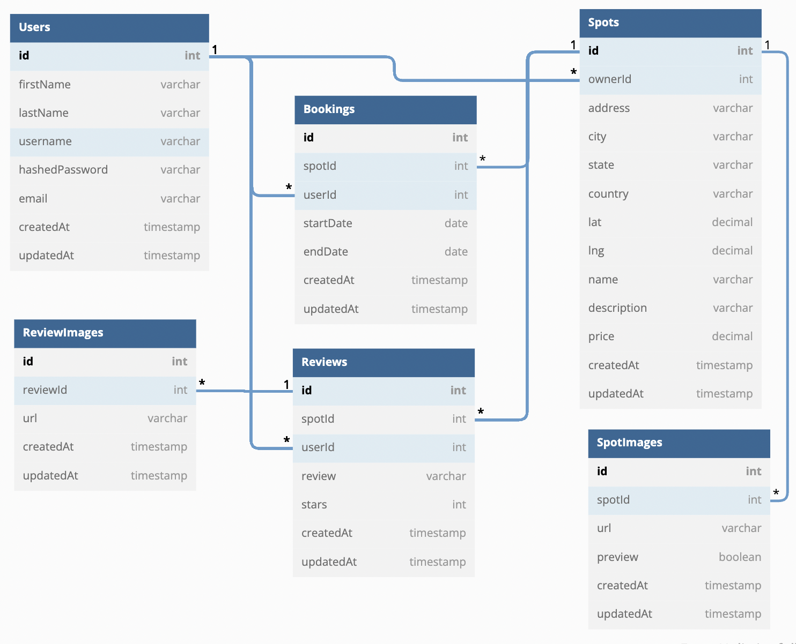

# Airdnd
[>>>Live Site<<<](https://airdnd-2rmu.onrender.com)

Airdnd is a web application inspired by Airbnb, the renowned online marketplace for both short and long-term homestays. Within Airdnd, users have the ability to create their own accounts, transforming their homes into welcoming hotels for travelers. Simultaneously, it offers the option for users to book their desired accommodations, creating memorable holiday experiences. Additionally, users can provide ratings and reviews based on their stays.

## Technology used
**Frontend:** JavaScript, Html, CSS, React, Redux

**Backend:** Node.js, Express, Sequelize, PostgreSQL

**Third-party service:** AWS S3, Google Map API

## Feature Lists

1. Sign up, log in, and demo user 

2. View spot details, buy create spot

3. Rate and comment on a spot

4. Search a spot

## Getting started
1. Clone this repository:

   `
   https://github.com/ccnuxuji/airdnd.git
   `
2. Install denpendencies into the Backed and the Frontend by making a terminal for each one and then run the following:

   * `npm install`

3. Create a **.env** file using the **.envexample** provided 

4. Set up your database with information from your .env and then run the following to create your database, migrate, and seed: 
 
   * `npx dotenv sequelize db:create`
   * `npx dotenv sequelize db:migrate` 
   * `npx dotenv sequelize db:seed:all`

5. Start the app for both backend and frontend using:

   * `npm start`

6. Now you can use the Demo User or Create an account

## Schema

## Contact me

Jimmy Xu, ccnuxuji@gmail.com, [Linkedin](https://www.linkedin.com/in/ccnuxuji/)